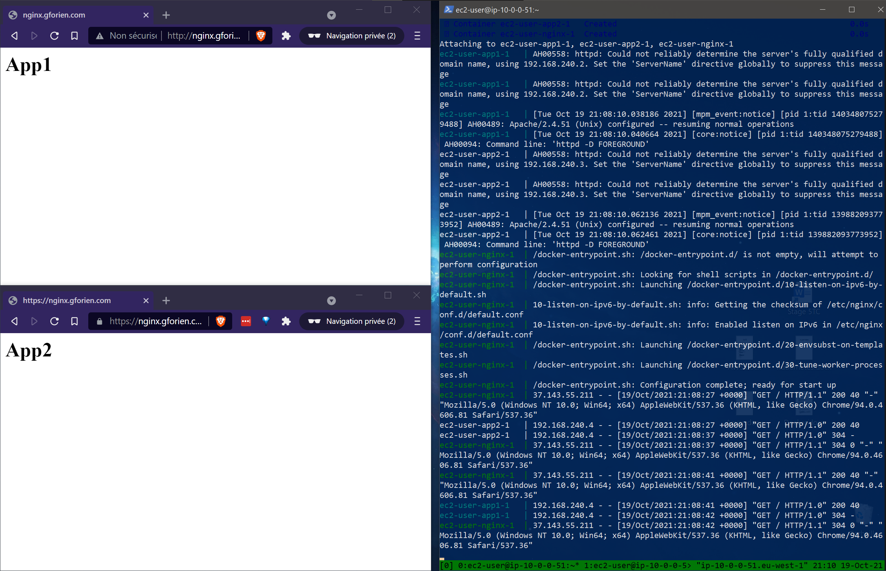

# docker-nginx-reverse-proxy 🐳🔀🌐



## Objective 🎯
I want two apps running at `nginx.gforien.com`, at the same IP on port 80.<br>
They could run in different folders, but then we would have to edit the baseUrl in each
app (so that async resources are served properly).<br>
We don't want to do that. Therefore, these apps must run in different subdomains.

## How to proceed 💡
- **[1. DNS - Redirect all domain names to nginx.gforien.com](#1-dns---redirect-all-domain-names-to-nginxgforiencom)**
- **[2. Run two httpd on localhost with separate ports](#2-run-two-httpd-on-localhost-with-separate-ports)**
- **[3. Add a nginx reverse proxy to localhost](#3-add-a-nginx-reverse-proxy-to-localhost)**
- **[4. Dockerize the nginx reverse proxy \(hence, use a docker network\)](#4-dockerize-the-nginx-reverse-proxy-hence-use-a-docker-network)**
- **[5. Wrap-up with docker-compose](#5-wrap-up-with-docker-compose)**
- **[6. Add https](#6-add-https)**
- **[7. Deploy on single-node docker swarm](#7-deploy-on-single-node-docker-swarm)**


### 1. DNS - Redirect all domain names to nginx.gforien.com
```
CNAME   nginx.gforien.com         ec2-73-8-12-150.aws.amazon.com
CNAME   app1.nginx.gforien.com    nginx.gforien.com
CNAME   app2.nginx.gforien.com    nginx.gforien.com
```
Launch nginx or httpd on the EC2 instance `d run -p 80:80 nginx`<br>
We can reach it via any of the domain names ✅


### 2. Run two httpd on localhost with separate ports
```sh
# app1
d run --rm --name app1 -d -p 8081:80 httpd
d exec app1 sed -i 's/It works!/App1/' /usr/local/apache2/htdocs/index.html

# app2
d run --rm --name app2 -d -p 8082:80 httpd
d exec app2 sed -i 's/It works!/App2/' /usr/local/apache2/htdocs/index.html
```
We reach app1 on :8081 and app2 on :8082 ✅


### 3. Add a nginx reverse proxy to localhost
```sh
sudo amazon-linux-extras install nginx1
sudo service nginx start
sudo vim /etc/nginx/nginx.conf
# ---------------------------------------------------------
# /etc/nginx.conf
# ---------------------------------------------------------
events {}
http {
    server {
        listen 80 default_server;
        server_name app1.nginx.gforien.com;

        location / {
            proxy_pass http://localhost:8081;
        }

    }

    server {
        listen 80;
        server_name app2.nginx.gforien.com;

        location / {
            proxy_pass http://localhost:8082;
        }
    }
}
```
We reach app1.nginx.gforien.com and app2.nginx.gforien.com, both on port 80 ✅


### 4. Dockerize the nginx reverse proxy (hence, use a docker network)
We change the proxy_pass directive to `proxy_pass http://app1;` and
`proxy_pass http://app2;` *(and we don't need to specify port :80)*.
```sh
# cleanup
d kill $(d ps -q)

# network
d network create net1

# app1
d run --rm --name app1 --net net1 -p 8081:80 -d httpd
d exec app1 sed -i 's/It works!/App1/' /usr/local/apache2/htdocs/index.html

# app2
d run --rm --name app2 --net net1 -p 8082:80 -d httpd
d exec app2 sed -i 's/It works!/App2/' /usr/local/apache2/htdocs/index.html

# nginx
d run --rm --name nginx --net net1 -p 80:80 -v ~/nginx.conf:/etc/nginx/nginx.conf nginx
```
We reach app1.nginx.gforien.com and app2.nginx.gforien.com, both on port 80 ✅<br>
*(We can remove the httpd exposed ports.)*


### 5. Wrap-up with docker-compose
Create a `docker-compose.yml`
```yaml
version: '3'

services:
    nginx:
        image: nginx
        volumes:
            - ~/nginx.conf:/etc/nginx/nginx.conf
        ports:
            - "80:80"
        depends_on:
            - app1
            - app2

    app1:
        image: httpd
        ports:
            - "8081:80"

    app2:
        image: httpd
        ports:
            - "8082:80"
```
*(We don't need to specify `container_name` for httpd servers, they have the correct name
inside the docker network.)<br>
(We can also remove the httpd exposed ports.)*

And execute
```sh
dc up -d \
&& dc exec app1 sed -i 's/It works!/App1/' /usr/local/apache2/htdocs/index.html \
&& dc exec app2 sed -i 's/It works!/App2/' /usr/local/apache2/htdocs/index.html
```


### 6. Add https
**⚠⚠ Don't forget to expose port 443 ⚠⚠<br>
Ports must be published in docker-compose and in AWS VPC Security Group !<br>
NGINX will exit if it cannot load the certificates but it won't print anything if ports
aren't exposed ! You will only receive a 'connection refused' error.**

Get the certificates
```sh
sudo certbot certonly --standalone \
    -d nginx.gforien.com \
    -d app1.nginx.gforien.com \
    -d app2.nginx.gforien.com
# certificates are at
#   /etc/letsencrypt/live/nginx.gforien.com/fullchain.pem
#   /etc/letsencrypt/live/nginx.gforien.com/privkey.pem
```

Add the https servers to `nginx.conf`
```nginx
events {}
http {
    server {
        listen 80 default_server;
        server_name app1.nginx.gforien.com;

        location / {
            proxy_pass http://app1;
        }
    }

    server {
        listen 80;
        server_name app2.nginx.gforien.com;

        location / {
            proxy_pass http://app2;
        }
    }

    server {
        listen              443 ssl;
        server_name         app1.nginx.gforien.com;
        ssl_certificate     /etc/letsencrypt/live/nginx.gforien.com/fullchain.pem;
        ssl_certificate_key /etc/letsencrypt/live/nginx.gforien.com/privkey.pem;

        location / {
            proxy_pass http://app1;
        }
    }

    server {
        listen              443 ssl default_server;
        server_name         app2.nginx.gforien.com;
        ssl_certificate     /etc/letsencrypt/live/nginx.gforien.com/fullchain.pem;
        ssl_certificate_key /etc/letsencrypt/live/nginx.gforien.com/privkey.pem;

        location / {
            proxy_pass http://app2;
        }
    }
}
```

Edit docker-compose.yml to mount the certificates<br>
We should be able to mount directly `/etc/letsencrypt/live/nginx.gforien.com` but as it
turns out, it only contains symlinks to the actual files. Hence, we can:
- bind-mount the whole directory `/etc/letsencrypt`
- or copy the certificates in a `foo/` directory, and bind-mount `foo/` and edit the path
to the certificates in the nginx.conf file.

➡ 1st solution is the simplest, and we don't want to copy our certificates.<br>
*(Also, keep in mind that certbot recommends not to move/rename our original certificates,
in order to renew them.)*

New `docker-compose.yml`
```yaml
version: '3'
services:
    nginx:
        image: nginx
        volumes:
            - ~/nginx.conf:/etc/nginx/nginx.conf
            - /etc/letsencrypt:/etc/letsencrypt
        ports:
            - '80:80'
            - '443:443'
        depends_on:
            - app1
            - app2
    app1:
        image: httpd
    app2:
        image: httpd
```
We require https only **in front** of nginx, not in the proxy_pass directive.<br>
See also [HTTPS behind proxy](https://reinout.vanrees.org/weblog/2017/05/02/https-behind-proxy.html).

Finally, execute
```sh
dc up -d \
&& dc exec app1 sed -i 's/It works!/App1/' /usr/local/apache2/htdocs/index.html \
&& dc exec app2 sed -i 's/It works!/App2/' /usr/local/apache2/htdocs/index.html
```
Works OK ✅


### 7. Deploy on single-node docker swarm
Same as docker-compose:
```sh
d swarm init

d stack deploy -c docker-compose.yml nginx-reverse-proxy

d exec ______ sed -i 's/It works!/App1/' /usr/local/apache2/htdocs/index.html
d exec ______ sed -i 's/It works!/App2/' /usr/local/apache2/htdocs/index.html

# to kill containers
d stack rm nginx-reverse-proxy
```
Works OK ✅

*One stack   = multiple services<br>
One service = multiple containers on multiple swarm nodes*

### Done !👏👏👏

### 📚 Sources
- [Host multiple Docker containers on a single server with NGINX reverse proxy (YouTube)](https://youtu.be/spbkCihFpQ8)
- [Run multiple site from one IP with NGINX reverse-proxy (YouTube)](https://youtu.be/x1fnOJsX6wE)
- [Docker-compose and NGINX reverse-proxy with multiple containers](https://www.bogotobogo.com/DevOps/Docker/Docker-Compose-Nginx-Reverse-Proxy-Multiple-Containers.php)
- [Docker and NGINX as reverse-proxy](https://www.grottedubarbu.fr/docker-nginx-reverse-proxy/)
